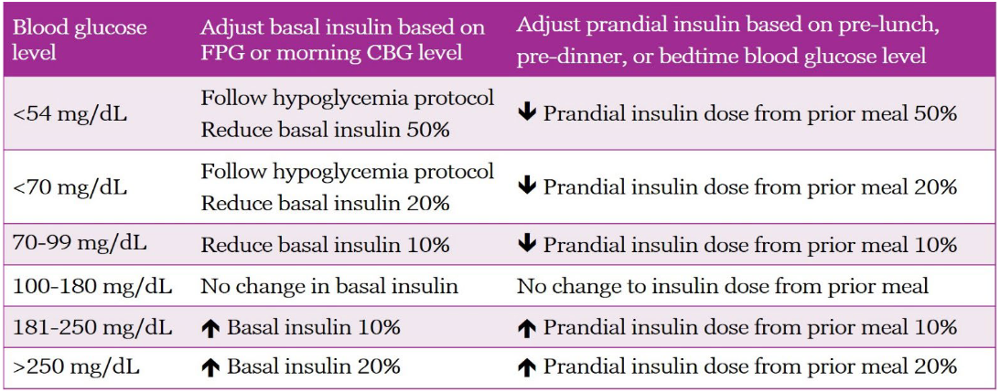

# Cardiac Arrest

## ACLS Algorithm for Cardiac Arrest

**What to ask back when being notified?**

* Notify intern, resident, staff รึยัง
* สั่งให้เตรียม ล้อ Emer, Cardiac board, เครื่อง Defib!!
* Advance care plan เอาอะไร ไม่เอาอะไรบ้าง


สำคัญ!

* หากได้ EKG monitor มาแล้ว ให้ Quick look ก่อน ใช้ paddle lead (ยังไม่ต้องรอติด lead) --> ระหว่างนี้ interrupt CPR ได้ แต่ไม่ควรเกิน 10 นาที
* หาก rhythm เป็น Torsades de point **ห้ามใช้ Amiodarone\*\*** และอย่าลืมให้ MgSO4 2 g IV slowly push
* หา Cause ด้วยเสมอ
  * 5H: H+ (Acidosis), Hypo/hyperkalemia, Hypovolemic, Hypoxia, Hypothermia
  * 5T: Tampoande, Thrombosis pulmonary (PE), Thrombosis coronary (MI), Toxins, Tension pneumonthorax


<figure><figcaption></figcaption></figure>
