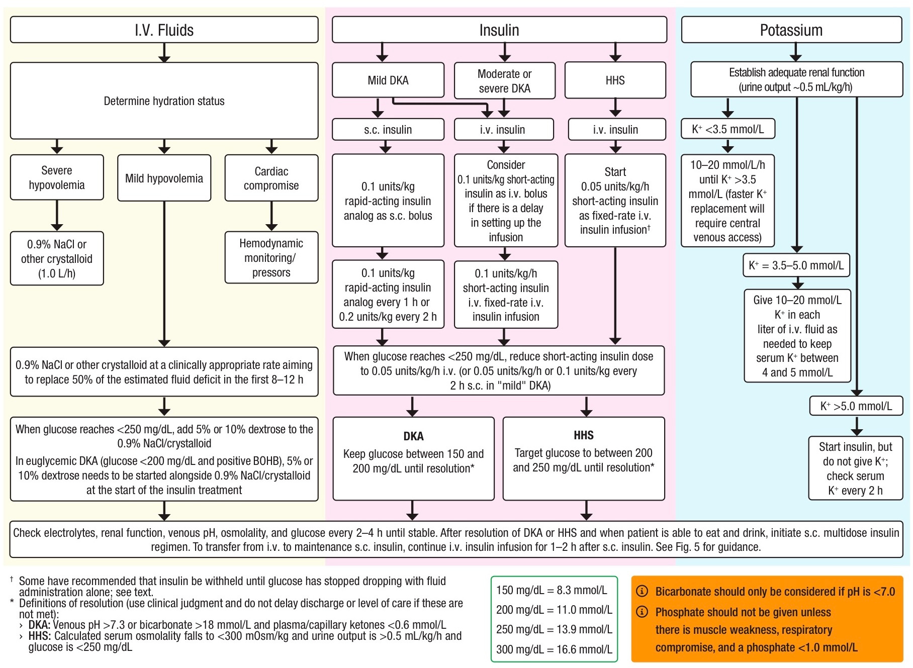

# Hyperglycemic Emergency

## Definition

<table><thead><tr><th>DKA</th><th valign="top">HHS</th></tr></thead><tbody><tr><td><ul><li><strong>D</strong>iabetes: BS ≥ 200 or Hx of DM</li><li><strong>K</strong>etone: blood ≥ 3 or urine ≥ 2+</li><li><strong>A</strong>cidosis: pH ≤ 7.3 or HCO3 ≤ 18</li><li>⚠️ Euglycemic DKA: SGLT2 inhibitor, insulin injection, reduced food intake, pregnancy, alcoholism, liver failure</li></ul>
<strong>Severity</strong>
<ul><li>Moderate DKA: pH &#x3C;7.25 or HCO3 &#x3C; 15 or drowsy</li><li>Severe DKA: ketone > 6 or pH &#x3C;7.0 or HCO3 &#x3C; 10 or stupor/coma</li></ul></td><td valign="top"><ul><li><strong>H</strong>yperglycemia: BS ≥ 600</li><li><strong>H</strong>yperosmolar: effective serum osm ≥ 300 = (2Na + BG/18)</li><li>Ab<strong>S</strong>ence of </li><li>❌Ketonemia: blood &#x3C;3 or urine &#x3C;2+</li><li>❌Acidosis: pH ≥ 7.3 or HCO3 ≥ 15</li></ul></td></tr></tbody></table>

## What to ask back when being notified?

* DM ?
* DTX/CBG = ?
* V/S, conscious
* อาการของผู้ป่วย เนื่องจากเราต้อง ddx อยู่ 3 ภาวะ ได้แก่ simple hyperglycemia, DKA (อาการของ acidosis เช่น หายใจเร็ว หอบลึก ปวดท้อง), HHS (dehydrate อาการทาง Neuro เช่น ซึม abnormal movement N/V)

## Patient Evaluation / สิ่งที่ \*\*ต้องทำ\*\* เมื่อเจอภาวะนี้

* V/S (tachycardia, hypotension -> severe hypovolemia)
* Volume status: dry, sunken eye, skin turgor, CRT, cold ext, postural hypotension
* Ix:&#x20;
  * Blood sugar, serum/urine ketone, VBG, serum osm
  * BUN, Cr, Electrolyte, Ca, Mg, P, LFT
  * CBC, H/C x II, UA, UG, UC
  * CXR, EKG

## Management

### IV fluids

* Severe hypovolemia
  * NSS 1000 ml IV in 1 hr
* Mild hypovolemia
  * NSS 500-1000 ml IV in 2-4 hr
* Cardiac compromise (old, HF, ESRD)
  * NSS ให้ครั้งละ 250 ml IV → hemodynamic assessment
* <mark style="background-color:red;">\*If Blood sugar < 250 เปลี่ยนเป็น 5% or 10% D/NSS</mark>
* หลังจาก initial fluid replacement ให้ correct fluid deficit ที่เหลือใน 24-48 hrs: IV rate ประเมินตาม volume status

### Insulin

* Mild DKA
  * Rapid-acting (e.g. Novorapid) 0.1 u/kg SC bolus then 0.1 u/kg SC q 1 hr
  * Blood sugar < 250 เปลี่ยนเป็น 0.1 u/kg q 2 hrs
* Mild/Moderate/Severe DKA
  * RI 0.1 u/kg IV bolus then 0.1 u/kg/hr IV drip
  * Blood sugar < 250 เปลี่ยนเป็น 0.05 u/kg/hr  IV drip
* HHS
  * RI 0.05 u/kg/hr IV drip


DKA keep BS 150-200 mg%, HHS keep BS 200-250 mg% until resolution


### Potassium

* Monitor EKG, urine output (keep ≥ 0.5 ml/kg/hr)
* K < 3.5
  * Hold insulin until K >3.5
  * KCl 10-20 mmol/L/hr
* K 3.5-5.0
  * Add KCl 10-20 mmol/L in each liter of IV fluid
  * Keep K 4-5
* K > 5.0
  * Monitor K q 2 hr
* Peripheral line K max: rate 10 mEq/hr, conc 60 mEq/L
* KCl 10 mmol/L → max rate = 1000 ml/hr
* KCl 20 mmol/L → max rate = 500 ml/hr

### Bicarbonate

* pH < 7.0 → 7.5% NaHCO3 100 ml in NSS 400 ml IV drip in 2 hrs
* ให้ซ้ำได้ q 2 hrs until pH > 7.0

### Phosphorus

* P < 1.0 mmol/L + muscle weakness/respiratory or cardiac compromise→ Add P 10-20 mmol/L

## Monitoring

* DKA
  * DTX/CBG q 1-2 hr
  * E’lyte, P, Cr, serum ketone, VBG q 4 hr
* HHS
  * DTX/CBG q 1-2 hr
  * E’lyte, Cr, serum osm q 4 hr

## Resolution

* DKA
  * pH > 7.3 _or_ HCO3 > 18 **AND** serum ketone < 0.6
* HHS
  * Serum osm < 300 **AND** UOP > 0.5 ml/kg/hr **AND** BS < 250 mg/dL **AND** improved cognitive status

<figure><figcaption></figcaption></figure>

## Standing Order

<figure><figcaption></figcaption></figure>
