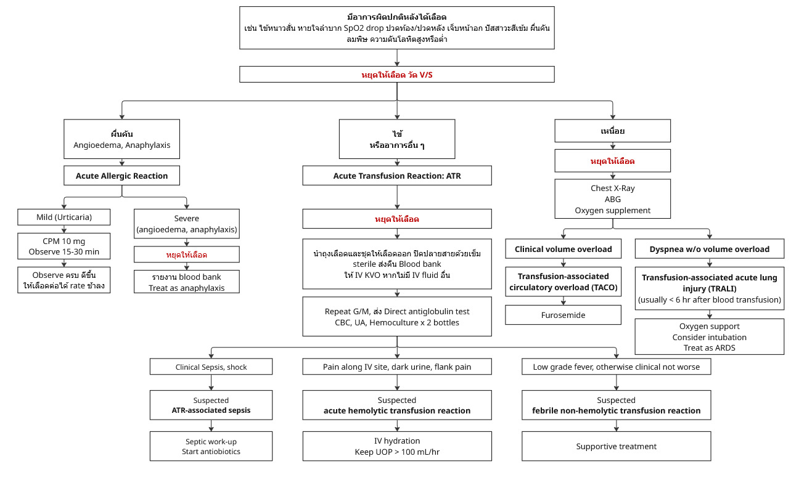

# Acute Transfusion Reaction

## Definition

* อาการที่ผิดปกติหลังได้เลือด เช่น
  * ไข้หนาวสั่น ความดันตก
  * เหนื่อย หายใจเร็ว ออกซิเจนในเลือดต่ำ
  * ปัสสาวะสีเข้มขึ้น ปัสสาวะสีดำ ปวดบั้นเอว
  * อาการไม่สุขสบาย
  * เจ็บแน่นหน้าอก

## Patient Evaluation

ให้พยายามแบ่งผู้ป่วยออกเป็น 3 กลุ่มอาการ

* ไข้
* ผื่น
* เหนื่อย

แล้วให้ approach ตามภาพนี้

<figure><figcaption></figcaption></figure>

### Fever (Acute Transfusion Reaction)


หยุดให้เลือดทุกรายที่มีอาการไข้

ส่งเลือดกลับ blood bank


#### ATR-associated sepsis

* สันนิษฐานว่ามีแบคทีเรียปนเปื้อนมาในเลือด
* ให้ [Septic workup](../infectious-disease/sepsis-and-septic-shock.md) และเริ่ม antibiotics

#### Febrile hemolytic transfusion reaction

* มักมีอาการ ปวดบริเวณเส้นที่ให้เลือด ปัสสาวะสีเข้มหรืออกน้อยลง ตัวเหลืองตาเหลือง ปวดบั้นเอวร่วมด้วย
* ให้ IV hydration และให้ UOP > 100 mL/hr

#### Febrile non-hemolytic transfusion reaction

* นอกจากอาการไข้ ผู้ป่วยมักไม่มีอาการผิดปกติอื่น ๆ
* Supportive treatment

### Dyspnea

ให้แบ่งผู้ป่วยออกเป็น 2 กลุ่ม

#### Transfusion associated circulatory overload (TACO)

* มี clinical heart failure: เหนื่อย ขาบวม JVP elevated hepatojugular reflux +ve
* รักษาแบบ heart failure
  * Furosemide
  * Keep I/O negative
  * Oxygen support

#### Transfusion-associated acute lung injury (TRALI)

* มักจะเหนื่อยมาก อาจมีร่วมกับไข้ แต่จะไม่มี sign of volume overload
* Pathophysiology ทำให้เกิดมี non-cardiogenic pulmonary edema ซึ่งอาจแย่จนกลายเป็น ARDS ได้&#x20;
  * treat as ARDS
  * Oxygen support
  * Consider ET intubation with mechanical ventilation

### Urticaria, Pruritus, Angioedema

แบ่งผู้ป่วยเป็น 2 กลุ่ม

#### Urticaria, Pruritus <mark style="background-color:$danger;">WITHOUT</mark> clinical anaphylaxis, or angioedema

* ให้ CPM 10 mg IV แล้ว Observe ต่อ 15-30 นาที
* หลัง observe หากผื่นยุบ หายคัน ให้ให้เลือดต่อได้ ในอัตราที่ช้าลง

#### Anaphylaxis or Angioedema

* Treat as anaphylaxis
  * Adrenaline 1:1,000 0.5 mL IM antero-lateral thigh.
  * Hydrocortisone 100 mg IV
  * Oxygen support

