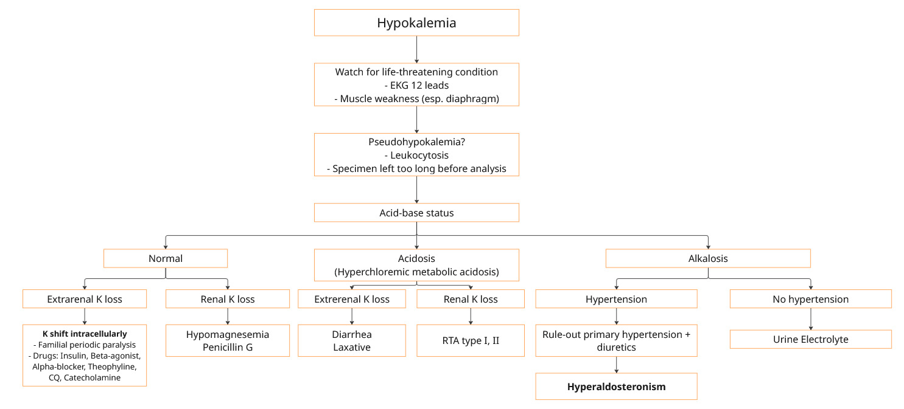

# Hypokalemia

## Definition

* Serum K < 3.5 mmol/L

## Patient Evaluation

* ต้อง Rule-out life-threatening condition เสมอ ซึ่งได้แก่
  * Respiratory muscle fatigue/paralysis
    * if present -> consider ET intubation to protect airway
  * Arrhythmia: both atrial arrhythmia and ventricular arrhythmia
    * EKG 12 leads
      * Flat T wave
      * QT prolongation
      * Present of U wave
      * ST-segment depression
* หากมีภาวะ life-threatening condition เหล่านี้ ต้องแก้ด้วย IV form of potassium

<figure><figcaption></figcaption></figure>

## Approach to Hypokalemia

<figure><figcaption></figcaption></figure>

## Management


หากไม่ severe hypokalemia prefer การแก้ด้วย oral มากกว่า IV


### Severe Hypokalemia

* Serum potassium < 2.5 mmol/L หรือ
* Symptomatic เช่น arrhythmia, muscle weakness
* อาจผสม
  * Peripheral:
    * NSS 1,000 mL + KCl 40 - 60 mEq IV drip rate 80 - 120 mL/hr \[3.2 - 4.8 mEq/hr]

| IV         | Concentration | Correction Rate                                                                                                                        |
| ---------- | ------------- | -------------------------------------------------------------------------------------------------------------------------------------- |
| Peripheral | <= 60 mEq/L   | <= 10 mEq/hr                                                                                                                           |
| Central    | <= 200 mEq/L  | 
&#x3C;= 20 - 40 mEq/hr <mark style="background-color:$danger;"><strong>หากแก้เกิน 10 mEq/hr ต้อง Monitor EKG</strong></mark>
 |

### Asymptomatic Hypokalemia

* Serum potassium ≥ 2.5 mmol/L
* If no acidosis:
  * Ped KCl 30 mL x 1-3 doses q 4 hr. (ขึ้นกับว่า K ต่ำแค่ไหน)
    * (For estimation only)
      * K 2.5 - 3.0 ⇒ 3 doses
      * K 3.0 - 3.2 ⇒ 2 doses
      * K 3.3 - 3.5 ⇒ 1 dose
    * ทั้งนี้ ขึ้นกับว่า ผู้ป่วยมี K loss มากน้อยแค่ไหน
* If acidosis (Esp RTA type I, II)
  * Shohl's solution
  * Polycitra solution
  * K citrate solution
* If hypophophatemia
  * Phosphate K


หากแก้ K แล้วดูไม่ค่อย response ให้ดู Serum Mg และแก้ Mg ด้วย!!!

