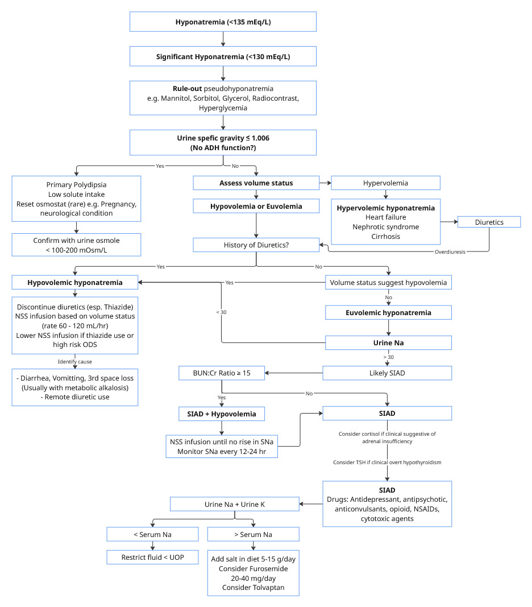

# Hyponatremia

## Hyponatremia

* Serum Na < 135 mmol/L

### Patient Evaluation

* ฺ**Rule-out** Emergency condition ที่ต้องให้ management เร่งด่วน ได้แก่
  * Symptomatic hyponatremia ซึ่งมีอาการได้แก่ อาเจียน (Intractable vomiting) ซึม (GCS <= 8) ชัก สับสน Cardiovascular distress เหล่านี้ต้องได้ 3% NaCl
* **Rule-out** pseudohyponatremia
  * **Mannitol**, Glycerol, Sorbitol, **Radiocontrast agent**
  * Hypertriglyceridemia, Hyperproteinemia
  * **Hyperglycemia (esp > 400 mg/dL)**



**กรณี Serum Glucose < 400 mg/dL**

$$
SNa = Measured\space Na +\frac{Glucose-100}{100}\times1.8
$$



**กรณี Serum Glucose > 400 mg/dL**

$$
SNa = MeasuredNa +\frac{Glucose-100}{100}\times2.4
$$



### Approach


ไม่ควรส่ง Lab Urine Elyte, Urine Osmole, Serum osmole แบบหว่านเป็นชุดทั้งหมด

สงวนการส่ง Lab TSH, Cortisol กรณีเป็น Euvolemic hyponatremia with ADH function ร่วมกับมี clinical sign and symptoms ของ Hypothyroidism หรือ addrenal insufficiency


<figure><figcaption></figcaption></figure>

### Management

### Severe Symptomatic Hyponatremia

* 3% NaCl 100-150 mL IV drip in 10 min
* Monitor serum Na q 1 hr
  * If clinical improved --> treat สาเหตุ
  * If no clinical improvement --> Repeat 3% NaCl ได้ max 3 doses
* Goal: Raise serum Na 4 - 6 mmol/L within first 4 - 6 hr


**ประเมิน Risk ODS เสมอ !!!**

If hyponatremia onset > 48 hr, or uncertain onset --> treat as hyponatremia

**High risk ODS = ≥ 2 of:** Serum Na < 105, Hypokalemia, Alcoholis, Advanced liver disease, Malnutrition


<table><thead><tr><th width="130">Risk ODS</th><th>Goal</th><th>Limit</th></tr></thead><tbody><tr><td>High</td><td>4 - 6 mmol/L in 24 hr</td><td>8 mmol in any 24 hour period</td></tr><tr><td>Intermediate</td><td>4 - 8 mmol/L in 24 hr</td><td>10 - 12 mmol/L in any 24 hour period ≤ 18 mmol/L in any 48 hour period</td></tr><tr><td>Low ([Na] > 125)</td><td>Normalization</td><td>Normalization</td></tr></tbody></table>

### Asymptomatic Hyponatremia

#### Hypovolemic hyponatremia

* หาสาเหตุ รักษาสาเหตุนั้น เช่น หากมี Diuretics ให้ off diuretics หรือหากมี diaarhea ให้ IV replacement ให้พอกับความต้องการ (Keep I/O positive)
* 0.9% NaCl rate 60-120 mL/hr ขึ้นกับว่าผู้ป่วยดู hypovolemia มากน้อยขนาดไหน

#### Euvolemic hyponatremia

* มักมีสาเหตุมาจาก SIAD
  * ต้องมองหาสาเหตุของ SIAD เสมอ เช่น มี Lung pathology (pneumonia, ILD), Antidepressant, Anticonvulsant
  * ในกรณีนี้ ส่ง Urine Na + Urine K เพื่อคิดว่าการ restrict fluid นี้จะสามารถทำให้ Serum Na ขึ้นได้หรือไม่
  * หาก UNa + UK > SNa การ restrict fluid อาจจะไม่ได้ผล
    * แนะนำให้เพิ่มเกลือแกงในอาหาร
    * พิจารณา restrict fluid + Furosemide
    * พิจารณา role of Tolvaptan

#### Hypervolemic hyponatremia

* Diuretics

### Overcorrection

* จะหยุดการแก้ NSS เมื่อ delta Na เกิน 6 (high risk), และ 8 (intermediate risk)
* Low risk ODS: ให้ off NaCl then F/U Na q 6 hr
  * หากยังเกิน target -> relowering ด้วย 5% DW 3 mL/kg หรือดื่มน้ำ +/- Desmopressin 204 mcg IV q 6 hr จนกว่า Serum Na จะลงมาอยู่ใน target
* High risk ODS: off NaCl และให้ relowering ทันที จนกว่า Serum Na จะลงมาอยู่ใน target

## Example Order

### Hypovolemic hyponatremia

<table data-full-width="true"><thead><tr><th>Note</th><th valign="top">Order for One Day</th><th valign="top">Order for Continuation</th></tr></thead><tbody><tr><td>
15/4/2569 08.00  Notify Na = 122 mmol/L Case male 65-year-old #Acute decompensated heart failure from NSTE-ACS #U/D: HTN, DLP, TVD S/P PCI  <strong>S:</strong> ตื่น ถามตอบรู้เรื่อง <strong>O:</strong> V/S stable, alert, aware, co-operative HEENT: no elevated JVP Lungs: Clear BSBL CVS: Regular, no murmur Abd: Soft, not tender Ext: No pitting edema  I/O cumulative negative 5,000 mL in 2 days Currently on furosemide 160 mg IV q 8 hr  POCT-glucose 141 mg/dL  IVC totally collapsed, maximal diameter 0.4 cm

Hyperdynamic LV  A-profile both lungs  CXR: not seen cephalization (improved from previous film)  <strong>A:</strong> # Hypovolemic hyponatremia from overdiuresis  <strong>P:</strong> Correct hyponatremia
</td><td valign="top"><ul><li>0.9% NaCl 1,000 mL IV rate 80 mL/hr</li><li>Electrolyte q 6 hr</li><li>Hold NSS if Serum Na change ≥ 6 mmol/L</li></ul></td><td valign="top"><ul><li>HOLD Furosemide</li></ul></td></tr></tbody></table>

### Severe Symptomatic Hyponatremia

<table data-full-width="true"><thead><tr><th>Note</th><th valign="top">Order for One Day</th><th valign="top">Order for Continuation</th></tr></thead><tbody><tr><td>15/4/2569 08.00  Notify Na = 105 mmol/L Case female 65-year-old  <strong>S:</strong> ตื่น ถามตอบรู้เรื่อง อาเจียน 3 ครั้งเป็นเศษอาหาร กินยา Thiazide อยู่ <strong>O:</strong> V/S stable, alert, aware, co-operative HEENT: no elevated JVP Lungs: Clear BSBL CVS: Regular, no murmur Abd: Soft, not tender Ext: No pitting edema  I/O balanced to positive  POCT-glucose 141 mg/dL  IVC distended, Collapsibility index 15%  A-profile both lungs  CXR: not seen cephalization (improved from previous film)  <strong>A:</strong> # Severe symptomatic hyponatremia (intractible vomitting) # Suspected Thiazide-induced hyponatremia  <strong>P:</strong> Correct hyponatremia</td><td valign="top"><ul><li>3% NaCl 150 mL IV drip in 20 min then</li><li>Electrolyte next 1 hr.</li><li>Notify Electrolyte next 1 hr.</li></ul></td><td valign="top"><ul><li>HOLD Thiazide</li></ul></td></tr></tbody></table>
