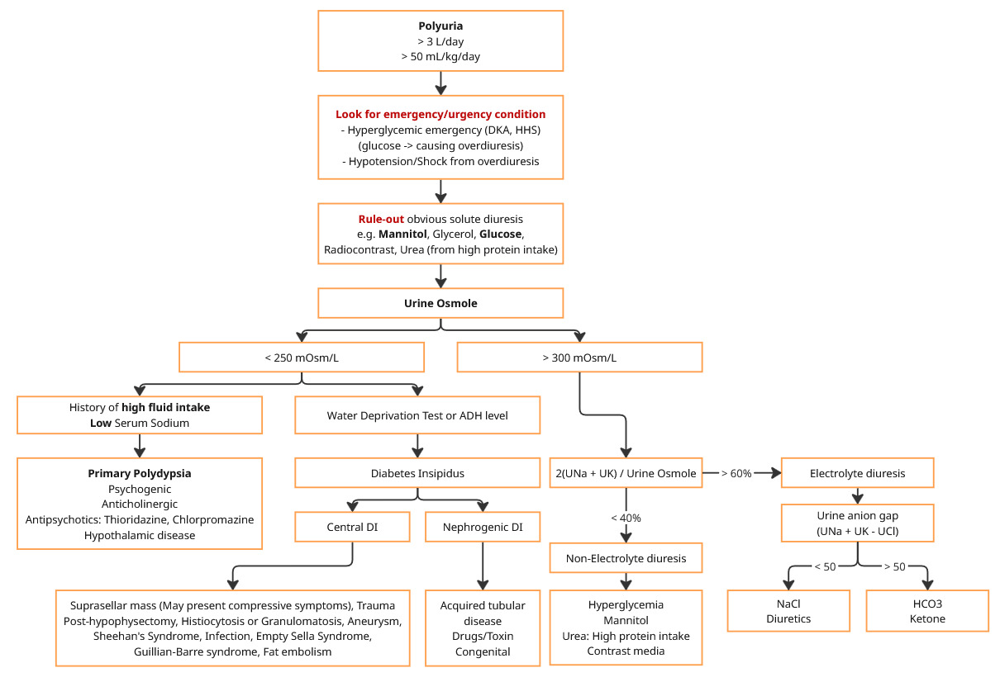

# Polyuria

## Definition

* UOP ≥ 3,000 mL/day
* UOP ≥ 50 mL/kg/day

## Patient Evaluation

* ทวทวน Intake, Output ตลอดทั้งวัน
* ตรวจสอบว่าขณะนี้มี IV อะไร rate เท่าไหร่ และ IV นั้นมีน้ำตาลหรือไม่
* ยาที่ทานประจำ โดยเฉพาะยาขับปัสสาวะ
* ยาที่ได้รับขณะนอนโรงพยาบาล เช่น Mannitol, Glycerol, Lithium, Cisplatin, Amphothericin B

### Lab

* หาก Rule-out obvious solute diuresis ได้ พิจารณาส่ง Lab ดังนี้
  * Urinalysis
  * Urine osmole
  * Urine Na, Urine K, Urine Cl
  * POCT-glucose
  * BUN, Creatinine, Electolytes

## Approach


ถ้าคนไข้มี Diuretics ก็น่าจะ polyuria จากยาขับปัสสาวะนั้น

ในกรณีนี้จะพูดถึงการ approach polyuria ในผู้ป่วยที่ไม่มี diuretics


<figure><figcaption></figcaption></figure>

#### 🔴 Look for Emergency / Urgency Conditions

* Hyperglycemic Emergency (DKA, HHS): น้ำตาลในเลือดสูงจัดจนทำให้เกิด Osmotic diuresis --> ควรเจาะ POCT-glucose ไว้เสมอ
* Hypotension / Shock: ภาวะความดันตกที่เกิดจากการสูญเสียน้ำทางปัสสาวะมากเกินไป (Overdiuresis)

#### 🟡 Rule-out Obvious Solute Diuresis

หาสาเหตุของ Solute diuresis จากประวัติและการรักษาที่ได้รับอยู่ก่อนหน้า:

* ได้รับยา Mannitol, Glycerol (เช่น ผู้ป่วย Neuro)
* ได้รับสารทึบรังสี Radiocontrast ภายใน 1-2 วันที่ผ่านมา
* มีภาวะ Glucose ล้นออกมาในปัสสาวะ
* ได้รับโปรตีนปริมาณสูงมาก (High protein intake/Tube feeding) ทำให้มี Urea ขับออกมาก

### Urine Osmolality Evaluation

หากประเมินเบื้องต้นแล้วยังไม่ทราบสาเหตุ ให้ส่งตรวจ Urine Osmolality (หากไม่มี ให้ดูค่า Urine Specific Gravity จาก UA แทนคร่าวๆ) เพื่อแยกกลุ่มโรค

### 🌊 Water Diuresis (Urine Osmole < 250 mOsm/L)

ปัสสาวะเจือจางมาก แสดงว่าร่างกายกำลังขับ "น้ำเปล่า" ออกมา แบ่งเป็น 2 สาเหตุหลัก:

**1. Primary Polydipsia (ดื่มน้ำมากเกินไปเอง**)

* Lab: มักพบ Serum Sodium ต่ำ (Hyponatremia)
* สาเหตุ: \* Psychogenic polydipsia (โรคทางจิตเวช)
  * ยาที่มีฤทธิ์ Anticholinergic (ทำให้ปากแห้งคอแห้ง เลยกินน้ำเยอะ)
  * ยา Antipsychotics บางชนิด (เช่น Thioridazine, Chlorpromazine)
  * Hypothalamic disease (ศูนย์ควบคุมความหิว/กระหายน้ำผิดปกติ)

**2. Diabetes Insipidus - DI (เบาจืด)**

* Lab/Test: ยืนยันด้วย Water Deprivation Test หรือการเจาะระดับ ADH level
* **Central DI (สมองไม่สร้าง ADH):**
  * สาเหตุ: Suprasellar mass (อาจมี Compressive symptoms ร่วมด้วย), Trauma/TBI, Post-hypophysectomy, Histiocytosis/Granulomatosis, Aneurysm, Sheehan's Syndrome, Infection, Empty Sella Syndrome, Fat embolism
* **Nephrogenic DI (ไตไม่ตอบสนองต่อ ADH):**
  * สาเหตุ
    * Acquired tubular disease เช่น multiple myeloma, pyelonephritis, obstruction, hypokalemia, Sjogren syndrome
    * Drugs/Toxins เช่น Lithium, Ethanol, Demeclocycline, Amphothericin
    * Congenital

### 🧂 Solute Diuresis (Urine Osmole > 300 mOsm/L)

ปัสสาวะเข้มข้น แสดงว่ามี "สารละลาย" บางอย่างดึงน้ำออกมา ให้ประเมินต่อด้วยสัดส่วนของ Electrolyte ในปัสสาวะ:

$$
\frac{2(UNa + UK)}{UOsm}
$$

#### **Electrolyte Diuresis (> 60%)**

สารละลายที่ดึงน้ำออกมาคือเกลือแร่ (Na, K) ให้คำนวณ Urine Anion Gap (UAG) ต่อเพื่อหาสาเหตุ

$$
UAG = UNa + UK - UCl
$$

* UAG < 50 ถึง 70 (ค่าแคบ/ติดลบ): คลอไรด์ ($$Cl−$$) ออกมาเยอะ บ่งชี้ว่าเป็น NaCl Diuresis หรือได้รับยาขับปัสสาวะ (Diuretics)
* UAG > 70 (ค่ากว้าง/บวกมาก): โซเดียมออกมาเยอะแต่ไม่ได้จับกับคลอไรด์ แสดงว่ามีประจุลบตัวอื่นดึงออกมา (Unmeasured anions) เช่น Bicarbonate ($$HCO3−​$$) หรือ Ketone

**2.2 Non-Electrolyte Diuresis (< 40%)**

สารละลายที่ดึงน้ำออกมาไม่ใช่โซเดียมหรือโพแทสเซียม (เป็นสารอื่นที่ไม่มีประจุ)

* สาเหตุที่พบบ่อย: Hyperglycemia (น้ำตาล), Mannitol, Contrast media, หรือ Urea (จาก High protein intake)


นี่เป็นเหตุผลว่าทำไมให้มองหา Obvious osmotic diuresis ตั้งแต่แรก จะได้ไม่ต้องรอ Lab เพื่อหาคำตอบ


