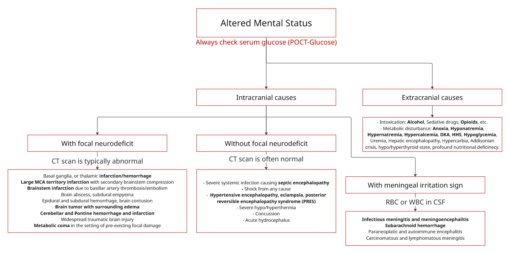

# Altered Mental Status (Alteration of Consciousness)

## Definition

การเปลี่ยนแปลงระดับการรับรู้ (Level of Consciousness) สามารถแบ่งตามความรุนแรงได้ 3 ระดับย่อย:

* **Drowsiness (ซึม)**: ปลุกตื่นได้ด้วยการกระตุ้นเพียงเล็กน้อย (เช่น เรียกชื่อ แตะตัว) และสามารถคงระดับการรับรู้ไว้ได้ชั่วขณะหนึ่ง
* **Stupor (ซึมลึก)**: ปลุกตื่นได้ยาก ต้องใช้การกระตุ้นที่รุนแรง (เช่น Deep pain stimulation) ถึงจะมีการตอบสนอง
* **Coma (โคม่า)**: ไม่สามารถปลุกให้ตื่นหรือตอบสนองได้ด้วยการกระตุ้นใด ๆ เลย


โดยทั่วไป ผู้ป่วยที่มีระดับความรู้สึกตัวลดลง มักจะมีภาวะ Confusion หรือการเปลี่ยนแปลงของ Content of consciousness ร่วมด้วยเสมอ


## What to ask back when being Notified?


อย่าลืมสั่งเจาะ POCT-Glucose ในผู้ป่วยทุกรายที่มีอาการซึม (AOC) เพื่อ Rule out ภาวะ Hypoglycemia ทันที!


* Patient Info: เป็นเคสอะไร? Diagnosis ตอนแรกรับคืออะไร? Admit มาด้วยเรื่องอะไร?
* Vitals: V/S เป็นอย่างไร? มี Hypotension, Desaturation, หรือ Hypo/Hyperthermia รุนแรงหรือไม่?
* Onset: ซึมลงมานานแค่ไหนแล้ว?
* Associated Symptoms: มีไข้หรือไม่? มีอาการทางระบบประสาทอื่นๆ นำมาก่อนไหม (เช่น มีอาการชักก่อนแล้วถึงซึม)?
* Medications: เพิ่งได้รับยาอะไรไปบ้าง โดยเฉพาะยานอนหลับกลุ่ม Benzodiazepines, Opioids, หรือยาที่มีฤทธิ์กดประสาท

## Patient Evaluation

### Initial Evaluation

**Initial Evaluation & Resuscitation**

* Assess Consciousness & GCS: ประเมิน Level of conscious, Content of consciousness และคำนวณ GCS score
  * 🚨 Airway Rule: If GCS score ≤  8 (หรือ ≤ 9 ตามบาง Guideline) หรือผู้ป่วย Cannot maintain airway ⇒ เตรียมทำ Endotracheal Intubation ทันที
* **Evaluate Reversible Causes:**
  * [**Hypoxia:**](../respiratory-system/acute-dyspnea-initial-management-and-resuscitation.md#initial-resuscitation-and-impending-respiratory-failure-assessment) ให้ O2 support (หรือ Intubate หาก Maintain airway ไม่ได้)
  * [**Hypoglycemia:**](../endocrinology/hypoglycemia.md#standing-order) ให้ 50% Glucose 50 mL IV slowly push
  * **Wernicke's Encephalopathy:** ให้ Thiamine 100 mg IV/IM
  * **Opioid Toxicity:** ให้ Naloxone 0.4 - 2 mg IV/IM q 2-3 minutes (Max 10-20 mg)

### Approach to Where and What is The Lesion

<figure><figcaption></figcaption></figure>

หากผู้ป่วยยังมีสติพอทำตามสั่งได้ ให้พิจารณาทำ Full Neuro Exam แต่ในรายที่ตรวจไม่ได้ (เช่น Drowsy, Stuporous, Comatose) ให้ใช้หลักการตรวจ **CPOMR** เพื่อประเมินรอยโรค:

* **C: Conscious:** ประเมินระดับความรู้สึกตัวตาม GCS
* **P: Pupil**
  * Unilateral fixation (รูม่านตาขยายข้างเดียวและไม่ตอบสนอง): ให้นึกถึง Uncal herniation หรือ Brainstem lesion
  * Pinpoint pupil (รูม่านตาหดเล็กมาก): ให้นึกถึง Opioid toxicity หรือ Pontine hemorrhage
  * Midposition fixed pupil (ขนาด 4-5 mm ไม่ตอบสนองต่อแสง): ให้นึกถึง Midbrain lesion
* **O: Ocular movement**
  * **Roving eye movement:** (ตากลอกไปมาพร้อมกันช้าๆ ซ้ายทีขวาที) บ่งบอกถึง Encephalopathy หรือ Bilateral hemispheric disease
  * **Oculocephalic Reflex (Doll's eye/Cervico-ocular reflex - COR):** ตรวจเมื่อไม่พบ Spontaneous eye movement (โดยการหมุนคอผู้ป่วยไปมาซ้ายขวาอย่างรวดเร็ว)
    * _ผลปกติ (Intact brainstem):_ ลูกตากลอกไปในทิศตรงข้ามกับที่หันหน้า (เช่น หันหน้าไปซ้าย ลูกตาจะกลอกไปขวา)
    * _ผลผิดปกติ (Absent reflex):_ ลูกตาขยับตามทิศที่หันหน้า ⇒ บ่งบอกถึง Brainstem lesion
  * **Hemispheric gaze preference (Conjugate gaze deviation):** ลูกตาทั้งสองข้างกลอกไปมองด้านใดด้านหนึ่งค้างไว้
    * _Destructive lesion (เช่น Ischemic stroke):_ รอยโรคอยู่ที่ Frontal eye field (FEF) "ตามองฟ้องรอยโรค" (มองไปด้านเดียวกับรอยโรค)
    * _Irritative lesion (เช่น Epilepsy):_ รอยโรคอยู่ที่ FEF "ตามองหนีรอยโรค" (มองไปด้านตรงข้ามกับรอยโรค)
  * **Dysconjugate gaze abnormalities:** แกนของลูกตาสองข้างไม่ขนานกัน นึกถึง brainstem lesion
  * **Sustained downward deviation:** Midbrain pretectum lesion เช่น hydrocephalus, tentorial herniation, thalamic hemorrhage, hepatic encephalopathy, hypoxia-ischemic encephalopathy.
  * **Sustained upward deviation:** พบไม่บ่อย แต่มีรายงานว่าพบใน Severe hypoxic-ischemic encephalopathy
* **M: Motor response**
  * Hemiparesis / Hemiplegia: รอยโรคอยู่ใน **Cerebral hemisphere ด้านตรงข้าม**กับที่ตรวจพบอาการอ่อนแรง
  * **Abnormal Posturing** (การเกร็งผิดปกติ):
    * **Decorticate posture (GCS M = 3): Abnormal flexion** (แขนงอเข้าหาลำตัว, กำมือ, ขาเหยียดตรง) ⇒ Lesion อยู่เหนือต่อ Midbrain (Corticospinal tract)
    * **Decerebrate posture (GCS M = 2): Abnormal extension** (แขนเหยียดตึง บิดเข้าด้านใน, ขาเหยียดตรง)⇒ Lesion อยู่ระดับ Midbrain / Diencephalon (แต่พบใน Metabolic encephalopathy ได้เช่นกัน)
* **R: Respiration**
  * **Cheyne-Stokes respiration (หายใจแรงสลับเบาแล้วหยุดพัก):** Bilateral hemispheric หรือ Diencephalon dysfunction
  * **Sustained hyperventilation (หายใจหอบลึกตลอดเวลา):** Midbrain lesion หรือมี Metabolic disturbance (เช่น DKA)
  * **Apneustic breathing (สูดหายใจเข้าลึกค้างไว้แล้วมี Expiratory pause):** Pontine lesion
  * **Ataxic breathing (หายใจไม่สม่ำเสมอ จับจังหวะไม่ได้):** รอยโรคที่ Medulla (อันตรายมาก ใกล้ Respiratory arrest)

## Investigation

<table data-header-hidden="false" data-header-sticky><thead><tr><th width="258">Investigation</th><th>Indication</th></tr></thead><tbody><tr><td>🚨 POCT-Glucose (DTX)</td><td>ทำทันทีในผู้ป่วยซึมทุกราย (Must Do!) เพื่อ Rule out hypoglycemia</td></tr><tr><td>BUN, Creatinine</td><td>สงสัย Uremic encephalopathy หรือประเมิน Renal function</td></tr><tr><td>Electrolytes (Na, K, Cl, HCO3)</td><td>สงสัย Hyponatremia/Hypernatremia, หรือประเมิน Anion gap</td></tr><tr><td>Ca, Mg, PO4</td><td>ส่งตรวจเพิ่มตามความเหมาะสม (โดยเฉพาะในรายที่มีอาการชักร่วมด้วย) อาจส่ง calcium ในรายที่มี malignancy</td></tr><tr><td>Liver Function Test (LFT)</td><td>สงสัย Liver failure หรือ Hepatic encephalopathy</td></tr><tr><td>Blood Ammonia Level</td><td>สงสัย Hepatic encephalopathy (ต้องเจาะใส่หลอดน้ำแข็งและรีบส่งห้องแล็บ)</td></tr><tr><td>Arterial Blood Gas (ABG)</td><td>สงสัย Hypoxia, Hypercapnia (CO2 retention), หรือประเมิน Acid-base status ใน Metabolic encephalopathy</td></tr></tbody></table>

### Neuroimaging

<table data-header-hidden="false" data-header-sticky><thead><tr><th width="231">Imaging Modality</th><th>Indication</th></tr></thead><tbody><tr><td>CT Brain without contrast</td><td>
• สงสัย Acute Ischemic Stroke / Hemorrhagic Stroke

• สงสัย Subarachnoid Hemorrhage (SAH)

• ประเมินภาวะ Increased Intracranial Pressure (IICP) หรือ Hydrocephalus ก่อนทำ LP
</td></tr><tr><td>CT Brain with contrast</td><td>
• สงสัย Brain Abscess

• สงสัย Brain Tumor (ทั้ง Primary และ Metastasis)
</td></tr></tbody></table>

### [Lumbar puncture](../../standing-order-for-procedures/lumbar-puncture.md)

เพื่อหา meningitis และ encephalitis


ห้ามทำเด็ดขาดหากผู้ป่วยมีภาวะต่อไปนี้\
1\) Increased intracranial pressure\
2\) Severe coagulopathy / Thrombocytopenia (Keep Plt ≥ 75,000-80,000 cells/cu.mm.)\
3\) Local infection at puncture site


