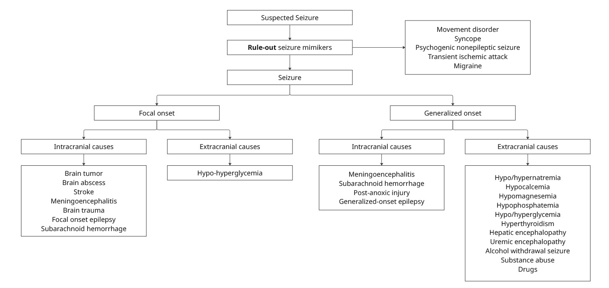

# Seizure

## Approach to Seizure

<figure><figcaption></figcaption></figure>

(ดัดแปลงจาก วิธีคิดเพื่อการแก้ปัญหาทางคลินิคอย่างเป็นระบบ โดย อรรถวิทย์ เจริญศรี และ สมนึก สังฆานุภาพ)

## What to ask back when being Notified?

* ตามพี่ Intern, Resident, Staff หรือยัง
* ชักมากี่นาทีแล้ว
* ให้พยายามจับ SpO2, HR ให้ได้
* เอา mask with bag 10 LPM มาใส่ให้ผู้ป่วยและให้จัดท่านอนตะแคง
* บอกให้เตรียม Diazepam 10 mg IV ไว้ข้างเตียง
* ให้ถ่ายวิดีโอขณะชักด้วย ให้เห็นทั้งตัว
* หลังจากนั้นให้เราวิ่งไปดูคนไข้ครับ

## Patient Evaluation

### Actively seizing&#x20;

* จัดท่า นอนตะแคงเพื่อป้องกัน aspiration
* ใส่ mask with bag 10 LPM
* พยายามจับ V/S: HR, SpO2
* เตรียม Diazepam 0.15 mg/kg \[max 10 mg] ไว้ข้างเตียง **ยังไม่ต้องให้ถ้ายังชักไม่ถึง 5 นาที**
* เตรียม suction ไว้ข้างเตียงเพื่อ clear airway หลังชักเสร็จ
* หาก 5 นาทีแล้วยังไม่หยุดชัก ให้รักษาแบบ **status epilepticus**

### History

* ให้ประเมินว่าเป็นชักจริง หรือเป็นการเคลื่อนไหวผิดปกติ
* ถามลำดับเหตุการณ์ กิจกรรมที่ทำขณะมีอาการ และอาการที่บ่งบอกว่าน่าจะเป็นอาการชักจริง
* การชักจริง จะต้องมีอาการ prodrome, pre-ictal (aura), ictal, และ post-ictal
  * prodrome:
    * อาจเกิดหลายนาทีถึงหลายชั่วโมงก่อนมีอาการชัก โดยผู้ป่วยจะจำเหตุการณ์ได้
    * มักเป็นอาการไม่จำเพาะ เช่น ไม่สบายเนื้อสบายตัว วิตกกังวล อารมณ์แปรปรวน ปวดศีรษะ หรือนอนไม่หลับก่อนมีอาการ เป็นต้น
  * pre-ictal
    * อาการเตือน ผํูป่วยจะมีอาการผิดปกติโดยที่ยังรู้ตัวและจำอาการได้ ลักษณะอาการขึ้นกับตำแหน่งจองสมองที่ก่อให้เกิดอาการชัก
    * โดยทั่วไปมักมีอาการก่อนไม่เกิน 10 นาที
    * หากเคยชักมาก่อน ลักษณะ pre-ictal symptoms จะมีอาการเหมือนเดิมกับที่เคยเป็น
    * ตัวอย่าง aura
      * somatosensory aura: ชาคล้ายมีหนามทิ่มตำ เหน็บ หรือปวดเฉพาะบางส่วน
      * visual aura: มองเห็นแสงสีกระพริบ เห็นแสงวูบวาบ หรือจุดสี
      * olfactory aura: ได้กลิ่นผิดปกติ ได้กลิ่นที่ไม่น่าพึงพอใจ
      * gustatory aura: การรับรสผิดปกติ ได้รับรสโลหะ หรือรสขม
      * abdominal aura: จุกแน่นลิ้นปี่ ปวดมวนท้อง ท้องไส้ปั่นป่วน
      * auditory aura: ได้ยินเสียงผิดปกติ เสียงหึ่ง เสียงหวีด
      * psychic aura: รับรู้ความทรงจำผิดไป รู้สึกคุ้นเคยกับเหตุการณ์ที่ไม่เคยเกิดขึ้นมาก่อน (deja vu) หรือกลัวขึ้ยมาเฉียบพลัน
      * autonomic aura: ใจสั่น ขนลุก โดยไม่มีอาการแสดงที่ทำให้ตรวจพบได้
  * ictal
    * อาการชักจริง มักเกิดขึ้นทันทีทันใด เป็น ๆ หาย ๆ ไม่เลือกเวลา (ยกเว้นการชักบางชนิดในเด็ก)
    * ระยะเวลาเฉลี่ยประมาณ 1-2 นาทีแล้วหยุดเอง และส่วนมากมักไม่เกิน 5 นาที
    * ส่วนใหญ่เกิดขึ้นเอง บางครั้งอาจมีปัจจัยกระตุ้น เช่น แอลกอฮอล์
    * หากเคยมีประวัติชักมาก่อน ลักษณะการชักจะเหมือนครั้งที่เคยเป็น
  * post-ictal
    * มักพบในรายที่เป็นเกร็งกระตุกทั้งตัว หรือ focal seizure with impaired awareness
    * อาการ: ซึม หลับ สับสน ปวดศีรษะ หรือคล้ายกับมีอาการทางจิตอยู่ช่วงหนึ่ง
    * บางรายมีแขนขาอ่อนแรงเฉพาะส่วน บางรายไม่สามารถสื่อสารได้ นึกคำไม่ออก หรือ ไม่เข้าใจคำถาม
* ปัจจัยกระตุ้น: อดนอน การดื่มเครื่องดื่มแอลกอฮอล์ การเห็นแสงกระพริบ เสียงดัง ความเครียดทางร่างกายและจิตใจที่รุนแรง หรือ ประจำเดือน
* ถามอาการที่อาจเป็นสาเหตุ เช่น การติดเชื้อในสมองและเยื่อหุ้มสมอง อุบัติเหตุต่อศีรษะ stoke ประวัติโรคตับหรือโรคไต ไข้สูงในเด็ก เป็นต้น
* ประวัติโรคประจำตัว เช่น โรคหลอดเลือดสมอง การผ่าตัดสมอง เนื้องงอกในสมอง โรคไต โรคตับ
* ประวัติยาที่ได้รับ โดยเฉพาะ tramadol, antibiotics โดยเฉพาะกลุ่ม imipenem, การถอนสุรา ยาต้านเศร้าต่าง ๆ
* ประวัติการได้รับวัคซีนเยื่อหุ้มสมองอักเสบ หัด และไอกรน
* ประวัติครอบครัว
* ประวัติความเสี่ยงอื่น ๆ เช่น โรคติดต่อทางเพศสัมพันธ์
* หากเป็นเพศหญิง ถาม LMP PMP ด้วย เนื่องจากอาจเป็น eclampsia

## Physical Examination

**Vital sign**

* Fever -> [meningitis](../../frequently-used-antimicrobials.md#meningitis), encephalitis
* Hypertension ->[ Posterior reversible encephalopathy syndrome](../cardiology/hypertension.md#patient-evaluation), [Eclampsia](../../obstetrics-and-gynecology/pregnancy-induced-hypertension.md)

**General appearance:**

* Level and Content of consciousness
* Mentally retarded
* Cognitive impairment
* Orofacial dyskinesia -> autoimmune encephalitis

**HEENT:**

* Surgical scar on scalp
* Trauma to the head
* Lateral tongue bite
* Gum hypertrophy (possibly on phenytoin)
* Jaundice, Parotid gland hypertrophy

**CVS:**

* Usually, look for congenital heart disease, which may accompany with syndromic features e.g. Down's syndrome, DiGeorge syndrome
* Arrhythmia

**Skin**

* Neurocutaneous syndrome
  * Tuberous sclerosis complex: facial angiofibroma, ash-leaf spots, shagreen patches, periungual and subungual hypermelanotic macules.
  * Neurofibromatosis: Iris hamartoma, axillary freckling, cafe-au-lait spot
  * Hereditary hemorrhagic telamgiectasia: mucocutaneous telangiectasia
* Palmar erythema

**Neuro:**

* Focal neurodeficit
* Stiff neck
* Sign of meningeal irritatation: Kernig's test, Brudzinski's test

**Abdomen:**

* Distended?, Jaundice?
* Spider nevi

## Management of status epilepticus



### Initial phase (0-5 minutes)

จัดสิ่งแวดล้อมให้ปลอดภัย ตรวจสอบว่ามีโรคประจำตัวเป็นลมชักเดิมอยู่แล้วหรือไม่

**จับเวลาตั้งแต่ผู้ป่วยเริ่มมีอาการชัก**



### Early phase (5-10 minutes)

Manage Airway, Breathing, Circulation

**เลือก**ให้ Midazolam (0.2 mg/kg) IM ⇒ max 10 mg/dose หรือ **Diazepam (0.15 mg/kg) IV max 10 mg/dose**

<figure><figcaption></figcaption></figure>

Take lab: POCT-glucose, electrolytes, Mg, Ca หากมียากันชักอยู่แล้ว พิจารณาส่ง drug level

Chronic alcohol drinking ⇒ Thiamine 100 mg IV (if hypoglycemia) ก่อนให้ Glucose



### Established phase (10-30 minutes)

Maintain ABC, may consider ET intubation

**เลือก**ให้ยากันชัก 1 ชนิด: Phenytoin, Phenobarbital, VPA, Levetiracetam, Lacosamide

พิจารณา CT, MRI ตามข้อบ่งชี้

<figure><figcaption></figcaption></figure>

<figure><figcaption></figcaption></figure>



### Refractory phase (30-60 minutes)

Endotracheal intubation, consult Critical care unit

ให้ยา anesthetics เช่น propofol, midazolam, thiopental, ketamine และให้ยากันชักชนิดที่สอง

<figure><figcaption></figcaption></figure>

<figure><figcaption></figcaption></figure>



<figure><figcaption></figcaption></figure>

<figure><figcaption></figcaption></figure>

## Management of First Episode Seizure

### Provoked Seizure: ไม่ต้องให้ AED

* หากมีปัจจัยกระตุ้นชัดเจน เช่น Hypo/hyperglycemia, hypo/hypernatremia, hypo/hypercalcemia หรือมี CNS insults เช่น amphetamine, eclampsia, alcohol withdrawal
* ให้เฉพาะ Benzodiazepine ระยะสั้น ๆ เท่านั้น

**พิจารณาให้ยากันชักในรายที่มีชักครั้งแรก ก็ต่อเมื่อ**

* ตรวจร่างกายมีความผิดปกติทางระบบประสาท
* มีประวัติโรคหรือความผิดปกติทางสมอง เช่น เคยติดเชื้อในสมอง ผ่าตัดสมอง หรือมี traumatic brain injury
* มีความเสี่ยงต่อการเกิดอุบัติเหตุ เช่น บุคลากรทางการแพทย์ คนขับรถ เนื่องจากการอดนอนเป็นตัวกระตุ้นการชัก
* เป็น Unprovoked seizure
* Semiology เป็น partial seizure
* มี epileptiform discharge จาก EEG
* CT/MRI ผิดปกติ

## Management of Breakthrough Seizure

* คุมอาการมาได้ช่วงระยะเวลาหนึ่ง จากนั้นชักซ้ำ
* ปัจจัยกระตุ้น: ทานยาไม่สม่ำเสมอ นอนน้อย แอลกอฮอล์ ป่วยไม่สบาย มีไข้ เป็นต้น
* [พิจารณาให้ Loading dose ของยากันชักตัวเดิม](seizure.md#management-of-status-epilepticus)

<figure><figcaption></figcaption></figure>

<figure><figcaption></figcaption></figure>

