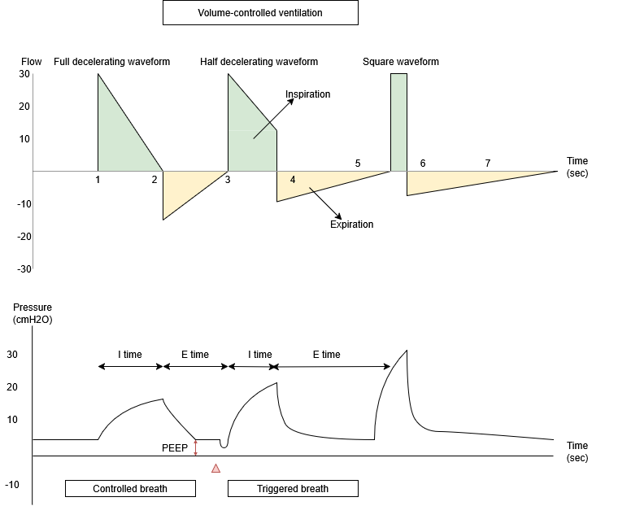
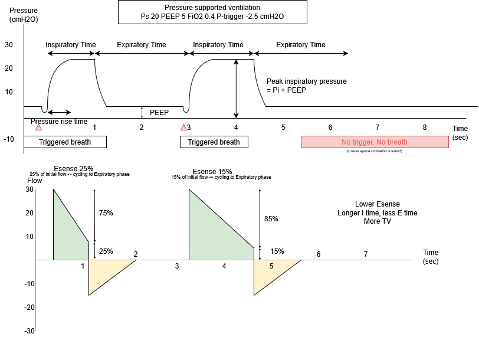

# ฺBasic Mechanical Ventilation

หลักจากการทำ Intubation เรียบร้อยแล้ว ขั้นตอนถัดไปคือการตั้งค่าเครื่องช่วยหายใข

## Indication for Intubation

* Respiratory Failure: Type 1 (Hypoxemic) หรือ Type 2 (Hypercapnic)
* Airway Protection: เช่น GCS $$≤$$ 8, ไม่สามารถไอขับเสมหะได้, ขาด Gag reflex
* Increased Work of Breathing: เหนื่อยหอบรุนแรง (เช่น severe metabolic acidosis) เพื่อลด Oxygen demand
* Upper Airway Obstruction: เช่น Anaphylaxis, Tumor, Secretion อุดกั้น
* Neuromuscular Weakness: เช่น Myasthenia Gravis crisis, Guillain-Barré syndrome

***

## Frequently used mechanical ventilator mode


Ideal body weight:

ผู้ชาย: 50 + 0.9 x (ส่วนสูง (ซม.) - 152.4)

ผู้หญิง: 45.5 + 0.9 x (ส่วนสูง (ซม.) - 152.4)


### Pressure-controlled Ventilation (PCV หรือ PC-CMV)

<figure><figcaption></figcaption></figure>

* หลักการ: กำหนด Pressure คงที่ในทุก breath ปล่อยให้ volume และ flow แปรผันตาม compliance ของปอด
* Indication
  * ผู้ป่วยที่ต้องการ Full support ได้แก่ ไม่มี Respiratory effort ต้องการลด work of breathing ต้องการควบคุม pH PaCO2
  * ต้องการควบคุม Inspiratory pressure ไม่ให้สูงเกินไปเพื่อป้องกัน Barotrauma เช่นในภาวะ ARDS, Pneumothorax
* กลไกการหายใจ
  * เมื่อผู้ป่วยเริ่ม Trigger เครื่องช่วยหายใจ จะปล่อยลมเข้าไป โดยค่อย ๆ เพิ่ม pressure จนถึง inspiratory pressure ที่ตั้งไว้ (Pressure rise time) จากนั้นจะความดันจะคงอยู่ในจุดนี้จนถึง Inspiratory time หลังจากนัั้นจะเปลี่ยน (cycling) เป็น expiratory phase
* **Parameter to set**
  * Pi (inspiratory pressure): แรงดันที่เครื่องจะตีเข้าปอด
  * Ti (inspiratory time) หรือ I:E Ratio: ระยะเวลาที่หายใจเข้า
  * PEEP (Positive end-expiratory pressure): แรงดันที่ค้างในปอดหลังหายใจออก
  * RR: อัตราการหายใจ
  * FiO2: ร้อยละของ O2
  * Trigger กรณีที่ผู้ป่วยดึงเครื่องเองถึงค่าที่ตั้งไว้ ให้เครื่องตี Setting ให้
* **Default setting**
  * Pi 15 cmH2O
  * PEEP 5 cmH2O
  * FiO2 เริ่มต้น 1.0 ทันทีหลังใส่ท่อ หลังจากนั้นค่อย ๆ ลดให้ได้ โดยใช้ FiO2 ต่ำที่สุดที่ทำให้ได้ SpO2 ≥ 94% (โดยทั่วไปตั้ง FiO2 0.4)
*
* **Monitor**
  * ให้ได้ TV 6-8 cc/kg of ideal body weight
  * PIP ต้องไม่เกิน 30 cmH2O
  * V/S: RR จริงของผู้ป่วย, SpO2

### Volume-controlled Ventilation (VCV หรือ CMV)

<figure><figcaption></figcaption></figure>

* หลักการ: กำหนด Volume คงที่ (Fix volume and flow) โดยปล่อยให้ pressure แปรผันตาม compliance ของปอด
* **Parameter to set**
  * VT (Tidal volume) เป้าหมาย 6-8 cc/kg of IBW
    * ทั้งนี้ขึ้นกับตัวโรคของผู้ป่วยด้วย
  * Peak inspiratory flow rate / I:E ratio
  * PEEP
  * Flow pattern (รูปแบบการจ่ายลม)
    * Decelerating flow: เป็น setting พื้นฐาน และเป็น physiologic ที่สุด โดยทั่วไปจะใช้ flow pattern นี้
    * Half-decelerating flow
    * Square Waveform: เหมือนเปิดก๊อกน้ำแรงสุดค้างไว้ น้ำเต็มขวดอย่างรวดเร็ว
      * I-time จะสั้นที่สุด ทำให้มีเวลาหายใจออก (E-time) เหลือเยอะ
      * ข้อดี: เหมาะกับคนไข้ Asthma หรือ COPD ที่ต้องการเวลาหายใจออกนานๆ (Prolonged E-time) เพื่อระบายลมที่ค้างในปอด (Auto-PEEP)
      * ข้อเสีย: Peak Inspiratory Pressure (PIP) จะพุ่งสูงมาก เพราะดันลมเข้าแรงและเร็ว
  * **Monitor**
    * V/S: RR, SpO2
    * PIP ต้องน้อยกว่า 35 cmH2O

### Pressure Support Ventilation (PSV หรือ Spont.)

<figure><figcaption></figcaption></figure>

* หลักการ: โหมดสำหรับเตรียม Wean หรือคนไข้หายใจเองได้ดีแล้ว ผู้ป่วยเป็นคนออกแรง Trigger เครื่องเองทุกครั้ง (ไม่มีการบังคับหายใจ)
* **Parameters to Set**
  * PS (Pressure support): Pressure ที่ช่วยผู้ป่วยตอนหายใจเข้า
  * PEEP
  * FiO2
  * ESense (Expiratory trigger sensitivity) ปกติตั้งไว้ที่ 25% เป็นจุดที่ปกติเครื่องจะตัดลมหายใจเข้าเปลี่ยนเป็นหายใจออก (cycling) เมื่อ flow ลดลงเหลือ 25% จาก flow ที่ผู้ป่วยดึงตอนเริ่มต้น
*   **Monitor**

    * RR สำคัญมาก เนื่องจากเราไม่ได้ตั้ง RR ต้องดูว่าผู้ป่วยหายใจเองเร็วเกินไปหรือไม่ เช่น มี apnea หรือไม่ หรือ หอบเหนื่อย หรือไม่
    * Tidal volume ควรได้ตาม Targeted tidal volume (6-8 mL/kg IBW)
    * V/S SpO2 RR


⚠️ อันตราย

* หากผู้ป่วยมีภาวะ ซึมลง, หลับลึก, ฤทธิ์ยา Sedative/Opioids ยังค้างอยู่, หรือเหนื่อยล้าจนกล้ามเนื้อไม่มีแรงดึง (Muscle fatigue) เครื่องช่วยหายใจก็จะไม่ทำงาน และปล่อยให้กราฟเป็นเส้นตรงระดับ PEEP (ดังภาพ)
* ผลลัพธ์: ผู้ป่วยจะเกิดภาวะหยุดหายใจ (Apnea)
* Ward Practice: เมื่อตั้งโหมด PSV ต้องสังเกตและตั้งค่า Apnea Backup Ventilation ไว้เสมอ (เช่น หากคนไข้ไม่หายใจนานเกิน 15-20 วินาที ให้เครื่องสลับกลับไปตีลมแบบ PCV/VCV โดยอัตโนมัติพร้อมส่งเสียง Alarm) เพื่อป้องกันภาวะ Hypoxia และ Cardiac arrest


| Mode | Trigger (ใครเริ่มหายใจ)     | Setting (Fix ค่าอะไร) | Variable (อะไรต้อง monitor) | Cycling (อะไรทำให้หายใจออก) |
| ---- | --------------------------- | --------------------- | --------------------------- | --------------------------- |
| PCV  | Time                        | Pressure (Pi)         | Volume (TV)                 | Time                        |
| VCV  | Time                        | Volume (TV)           | Pressure (PIP)              | Volume หรือ Time            |
| PSV  | Pressure/Flow (แล้วแต่ตั้ง) | Pressure (PS)         | Volume (TV)                 | Esense                      |
