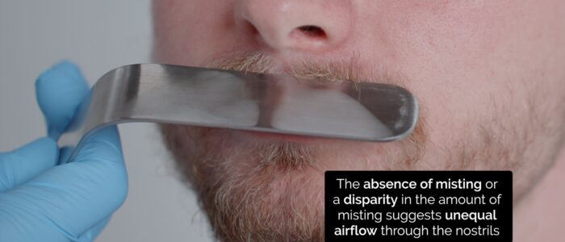

# Dyspnea in the Newborn

Definition

* increased work of breathing and/or respiratory distress
* **Tachypnea (RR > 60 breaths/min)** / Nasal flaring / Grunting / Chest retractions (subcostal, intercostal, suprasternal) / Cyanosis (in severe cases)
* DDx Dyspnea in NB ตามระบบ
  * Pulmonary, Neuro, Cardio, Metabolic, others
* Common Causes
  * Respiratory distress syndrome (RDS)&#x20;
  * Transient Tachypnea of the Newborn (TTN)
  * Meconium aspiration syndrome (MAS)
  * Neonatal pneumonia

## **What to ask back when being notified?**

* GA, Age(hr), onset of symptom
*   Risk factors

    * **Maternal:** triple I, DM, TORCHES, asthma
    * **Peripartum:** meconium-stained AF, oligohydramnios, C/S, precipitous delivery
    * **Neonatal:** prematurity, lung/airway anomalies, male, white, SGA/LGA, clinical sepsis

    DDx Congenital heart disease, Hypoglycemia, Polycythemia, EONS

## Patient Evaluation

* **General Appearance**: Alert, Irritable, Lethargic, or Cyanosis
* **Respiratory**: Tachypena (RR > 60), Increased work of breathing (nasal flaring, grunting, chest retractions), breath sounds.
* **Cardio**: Tachypnea, Murmur, Prolonged capillary refill time, Weak pulse, Pre-post ductal SpO2
* **Abdominal**: Distention, Hepatomegaly
* **Neurological**: Hypotonia, Seizure, Jitteriness
* **Skin:** Centra/Peripheral cyanosis

## Initial Management

### Nasal air flow test

* นำ slide มาอังตรงรูจมูกทั้ง 2 ข้าง เพื่อดูว่ามี airflow obstruction ซึ่งอาจเป็นสาเหตุของ dyspnea หรือไม่

<figure><figcaption></figcaption></figure>

### Investigation

* CXR
* EONS risk evaluation, Septic W/U (if suspected): H/C x II, CBC with PBS, CRP
* Antibiotics if indicated

## Supportive Care

* Respiratory Support
  * Respiratory distress syndrome -> Early CPAP, <mark style="color:blue;">Surfactant therapy</mark>
  * Transient tachypnea of the newborn -> Oxygen box, HHHFNC, CPAP
  * Meconium aspiration syndrome -> CPAP, NPO, IV fluid, +/- Empirical ATBs
  * Congenital pneumonia -> Septic W/U, <mark style="color:blue;">Empirical ATBs up to 7-10 days</mark>
  * Consider ET tube if respiratory failure
* Oxygen supplement
  * SpO2 ≥ 95% (Term)
  * SpO2 90-94% (Preterm
* General Care
  * Control BT 36.5 - 37.5 C
  * +/- NPO and IV
    * NPO if RR > 80/min
  * Correct other metabolic problems
  * Monitoring

## Common Chest X-Ray

### Respiratory Distress Syndrome



* **Hypo**aeration
* Fine reticulogranular infiltration (ground glass opacity)
* Air bronchograms
* White-out lungs (complete opacity of lungs)



.png>)



### Transient Tachypnea of the Newborn



* **Hyper**aeration
* Fluid-filled in interlobar fissure
* Bilateral interstitial and alveolar infiltration
* Prominent pulmonary vasculature
* Sunburst appearance
* Pleural effusion (rare)



.png>)



### Meconium Aspiration Syndrome



* Inhomogeneous lesion
* Patchy or steaky infiltration
* Areas of consolidation, atelectasis & hyperinflation



.png>)



### Congenital Pneumonia



* Diffuse alveolar infiltration
* Air bronchogram
* Ground glass appearance
* Patchy infiltration
* Lobar consolidation



.png>)



## Standing Order


ขึ้นกับ Diagnosis ที่คิดถึง


<table><thead><tr><th width="249">NOTE</th><th>ORDER FOR ONE DAY</th><th>ORDER FOR CONTINUATION</th></tr></thead><tbody><tr><td>
10/04/2569

15.50 น. 

DOL 0 -> 1

BBW 3000 gm

# Term male/female newborn, GA 38 weeks/U/S, Elective C/S due to previous C/S, Apgar 9-10-10, BBW 3000 gm, AGA

# Thin meconium (ตอนคลอด suction 2 สาย)

 

Notify หายใจเร็ว 90-100 ครั้ง/min
</td><td>

<ul><li>CXR portable stat</li><li>On cannula 1 LPM (FiO2 1.0, Effective FiO2 0.47), keep SpO2 >=95%</li><li>CBC c PBS, CRP stat and 06.00 น. 11/04/2569 at 20 hr</li><li>H/C x II</li></ul></td><td>

<ul><li>Ampicillin 300 mg IV q 8 hr (100 MKDose)</li><li>Gentamicin 12 mg + 5%DW 3 ml IV drip in 30 mins q 24 hr (4 MKDose)</li></ul></td></tr></tbody></table>

**Progress Note**

\# ใส่ # ให้ครบ

\# thin meconium

Notify หายใจเร็ว 90-100 ครั้ง/min + <mark style="color:$warning;background-color:red;">บอก onset ณ อายุที่กี่ชั่วโมงเสมอ \*\*\*</mark>

**S:** หายใจเร็วตื้น ไม่เขียว ไม่มีปีกจมูกบาน มีหายใจใช้กล้ามเนื้อซี่โครงเล็กน้อยเป็นช่วง ๆ ไม่มีประวัติสำลักนม

**O:** V/S สำคัญมาก: BT 37, HR 150 bpm, RR (นับเอง) 80/min, SpO2 98% (RA)

* Slide test: pass
* Active, no cyanosis, good nasal airflow, no obvious dysmorphic features
* RS: no stridor, no nasal flaring, mild subcostal retraction, clear and equal both lungs
* CVS: pulse regular 2+ all, no murmur

**A:** RD suspected AF aspiration, EONS

**P:** Tx as symptomatic infant -> septic w/u + empirical ATB + CXR P

