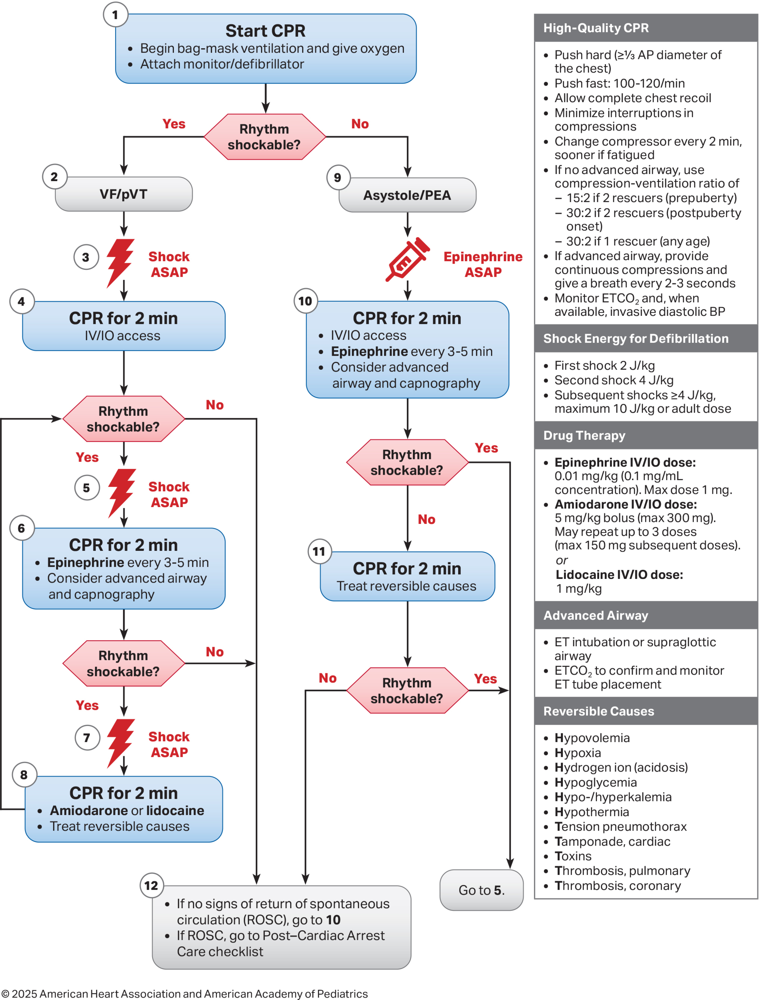

# Pediatrics Cardiac Arrest

เมื่อประเมินพบว่าเด็กไม่มีชีพจร (No pulse) ให้เริ่ม High-Quality CPR ทันที และเมื่อเครื่อง Defibrillator มาถึง ให้รีบติดแผ่น Monitor เพื่อแยก Rhythm เป็น 2 ฝั่ง:

<figure><figcaption></figcaption></figure>

## Shockable Rhythm

* "Shock ASAP" (ไม่ต้องรอ!)
* ทันทีที่เครื่องพร้อมและติดแผ่นเสร็จ ให้ประเมิน Rhythm ถ้าเป็น VF/pVT ให้สั่งชาร์จและ "Shock ทันที" ไม่จำเป็นต้องรอให้ปั๊มจนครบ Cycle 2 นาที

**Defibrillation Energy (พลังงานไฟฟ้า):**

* 1st Shock: เริ่มที่ 2 J/kg
* 2nd Shock: เพิ่มเป็น 4 J/kg
* Subsequent Shocks (ครั้งต่อๆ ไป): $$≥$$ 4 J/kg (Max ไม่เกิน 10 J/kg หรือไม่เกิน Max dose ของผู้ใหญ่ คือ 200 J)
  * โดยปกติเพิ่มจาก 2 J/kg → 4 J/kg → 6 J/kg → 8 J/kh → 10 J/kg

## Non-Shockable Rhythm

* ทันทีที่เห็นว่าเป็น Asystole หรือ PEA ให้รีบฉีด Epinephrine ทันทีที่เปิดเส้นได้ (ยิ่งให้ยาเร็วภายใน 5 นาทีแรก โอกาสรอดชีวิตยิ่งสูง)
* Epinephrine
  * Dose: 0.01 mg/kg (จำง่ายๆ คือใช้แบบเจือจาง 1:10,000 ปริมาตร 0.1 mL/kg)
  * IV กับ IO เท่ากัน
  * โดสยาทาง ETT จะต้องใช้สูงกว่าทาง IV ถึง 10 เท่า (คือ concentration 1:1,000 ปริมาตร 0.1 mg/kg)

## Drugs Dose Concerns


ให้ผ่านทาง IV หรือ IO เป็นลำดับแรกเสมอ หากเปิดเส้นไม่ได้จริงๆ ถึงจะพิจารณาให้ทางท่อช่วยหายใจ (ETT)


* การคำนวณยาและพลังงานไฟฟ้าทั้งหมดให้คิดตาม <mark style="color:orange;">"น้ำหนักจริง (Actual body weight)"</mark> ของเด็ก โดย<mark style="color:orange;">ไม่เกินโดสผู้ใหญ่</mark>

## Monitoring CPR Quality

Advanced Monitoring (การประเมิน High-Quality CPR จาก Arterial Line)

* ในกรณีที่เป็น In-Hospital Cardiac Arrest (IHCA) ที่ผู้ป่วยที่มี Arterial line อยู่แล้ว Diastolic Blood Pressure เพื่อประเมินคุณภาพของการกดหน้าอกได้
  * Infant (ทารก): Keep DBP $$≥$$ 25 mmHg
  * Child (เด็กโต): Keep DBP $$≥$$ 30 mmHg
  * _(หากค่า DBP ต่ำกว่านี้ ให้รีบ recheck CPR quality)_

