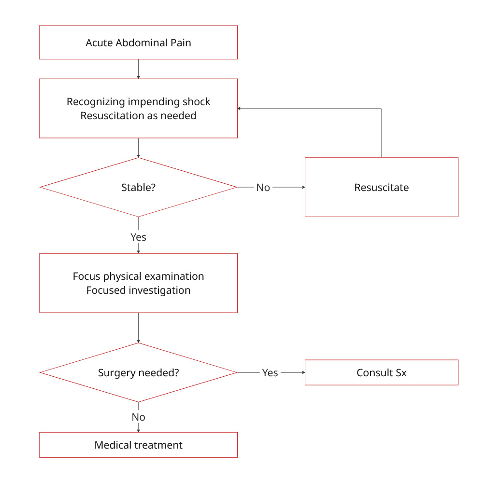

# Acute Abdominal Pain

## Initial Evaluation

* ให้ไปประเมินว่าผู้ป่วย clinical เป็นอย่างไร ดูมี emergency condition ที่ต้องจัดการการอย่างเร่งด่วนหรือไม่ เช่น
  * Peritonitis ที่ต้อง Emergency surgery (เช่น Peptic ulcer perforation, Ruptured appendicitis)
  * ในผู้หญิง ควร rule-out pregnancy ด้วยเสมอ ไม่ว่าจะด้วยการถาม LMP, PMP หรือการตรวจ Urine pregnancy test ก็ตาม
    * มีผลกรณีต้อง CT หากมีเด็กอาจทำให้เกิดความเสี่ยงต่อตัวเด็กในการโดนรังสี
    * ควรนึกถึง OB หรือ Gyne condition ร่วมด้วยเสมอ [pelvic-pain.md](../obstetrics-and-gynecology/pelvic-pain.md "mention")
* ถามประวัติ SOCRATES / LODCRAFT แล้วแต่ถนัด เพื่อช่วย Differential diagnosis จะได้ไม่เปลือง Lab / Imaging มากเสียจนเกินไป

<figure><figcaption></figcaption></figure>

## Resuscitation

* พิจารณา Monitor แบบ continuous ในรายที่ดูมี severe pain
  * HR, EKG, SpO2, BP
  * +/- Retain Foley's catheter --> record UOP
* หากมี Hypotension / sepsis ให้รักษาแบบ sepsis ไปก่อน [sepsis-and-septic-shock.md](../internal-medicine/infectious-disease/sepsis-and-septic-shock.md "mention")
* Lab
  * CBC, BUN, Creatinine, Electrolyte
  * Coagulation test
  * G/M Blood product (กรณีสงสัยว่ามีเลือดออก)
  * LFT (กรณีสงสัย Hepatobiliary cause)

## Focused History and Physical Examination

* ซักประวัติและตรวจร่างกายเพื่อช่วยในการวินิจฉัย
* อย่าลืมถาม NPO time, อย่าลืมถามประวัติผ่าตัด
* Differential ตามที่ถนัด ว่าชอบตาม Organ หรือตาม Quadrant

## Focused Laboratory Investigation

<table><thead><tr><th width="289">Lab</th><th>Suspected Condition</th></tr></thead><tbody><tr><td>Amylase, Lipase</td><td>Pancreatitis (Lipase specificity สูงกว่า Amylase)</td></tr><tr><td>Serum hCG, Urine preg. test</td><td>Pregnancy, Ectopic/Molar pregnancy</td></tr><tr><td>Platelet, Coagulogram</td><td>GI bleeding, Coagulopathy, Chronic liver disease</td></tr><tr><td>Electrolyte</td><td>Dehydration, Electrolyte imbalances</td></tr><tr><td>Blood glucose</td><td>Pancreatitis, DKA</td></tr><tr><td>Hematocrit</td><td>GI bleeding</td></tr><tr><td>Lactate</td><td>Mesenteric ischemia, sepsis</td></tr><tr><td>Liver function test</td><td>Cholangitis, Cholecystitis, Liver abscess, Cholelithiasis</td></tr><tr><td>BUN, Creatinine</td><td>AKI, CKD, Dehydration, Sepsis</td></tr><tr><td>Urinalysis</td><td>UTI, Urinary tract stone, Pyelonephritis</td></tr><tr><td>EKG and Troponin</td><td>Myocardial infarction</td></tr><tr><td>Stool exam</td><td>Inflammatory or Infectious Diarrhea</td></tr><tr><td>Acute abdomen series (Chest PA upright, Abdomen AP supine, Abdomen AP upright)</td><td>Bowel ischemia, Bowel ileus, Bowel perforation (Pneumoperitoneum, Surgical indication), Gallstone (10%), Kidney stone (90%)</td></tr><tr><td>Ultrasound Upper Abdomen</td><td>Cholecystitis, Cholangitis, Pancreatitis, Liver abscess, Intra-abdominal fluid collection`</td></tr><tr><td>Ultrasound KUB</td><td>Renal stone, Ureteric stone, Vesicular stone</td></tr><tr><td>Ultrasound Gyne</td><td>Gynecologic condition</td></tr><tr><td>CT abdomen</td><td>Uncertain diagnosis</td></tr></tbody></table>

## Supportive Treatment


หากเป็นไปได้ ให้ได้ Final diagnosis ก่อนจึงให้ pain control ศัลยแพทย์บางท่านยังเชื่อว่าการให้ยาแก้ปวดจะบดบังการตรวจร่างกายทางหน้าท้อง


### Proton Pump Inhibitors

* Omeprazole (20) 1 tab po ac
* Omeprazole 40 mg IV stat (กรณีกินไม่ได้)

### Anti-spasmodic drugs

* Hyoscine (Buscopan) (10) 1 tab tid OR
* Hyoscine 20 mg IV stat

### Anti-emetics

* Ondansetron 4 mg IV prn q 4 hr; max 32 mg/day
* Metoclopramide 10 mg IV (ระวัง QT prolongation, Extrapyramidal side effect)

### Analgesic

* Morphine 3-5 mg IV prn q 4-6 hr

### Antibiotics

* พิจารณาในเคสที่ดู Peritonitis, Sepsis ไปแล้ว
  * Ceftriaxone 2 g IV OD
  * Metronidazole 500 mg IV q 8 hr
